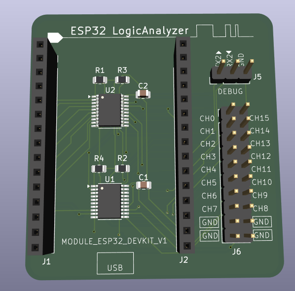

# ESP32 LogicAnalyzer


A [SUMP](http://dangerousprototypes.com/docs/The_Logic_Sniffer%27s_extended_SUMP_protocol) compatible 16Bit Logic Analyzer for ESP32 MCUs.


## Specifications

- Uses **ESP32 I2S DMA** and can capture speeds up to **20 MHz**.
- Supports **8-bit** and **16-bit** operations.
- Maximum **128k** samples (even in 8-bit capturing mode).
- RLE compression supported.
- Default OLS port is **UART0** with a default baud rate of **912600**.
- You can configure UART ports and high-speed baud rates for OLS communication by editing the definitions in LogicAnalyzerConfig.h.

### Supported Environments

| Environment    | Status | Details                                 |
|----------------|--------|-----------------------------------------|
| PlatformIO     | ✅     | Tested with `platform-espressif32@6.10.0` |
| Arduino IDE    | ✅     | Tested with `Arduino-ESP32 core 3.2.0`    |

### Under Development

- WROOVER modules support **2M** samples but only up to **2 MHz** due to bandwidth limits on PSRAM access.
- Analog input support.

## Quick Start Guide

### Environments

#### PlatformIO

1. Install [PlatformIO](https://platformio.org/) in VS Code.
2. Open the project folder in PlatformIO.
3. Build the project and flash it to your ESP32.

#### Arduino IDE

1. Install the **ESP32 board support** via the Boards Manager (`esp32 by Espressif Systems`).
2. Open the sketch in `ESP32_LogicAnalyzer/ESP32_LogicAnalyzer.ino`.
3. Select the board you're using (e.g. `ESP32 Dev Module`).
4. Make sure you're using the ESP32 Arduino core version 3.2.0.
5. Click **Upload**.

**Important:** If you're using UART0 for OLS communication, set **Core Debug Level = None** in the Arduino IDE before compiling, especially for captures above 10 MHz.

### PulseView

Open PulseView with:
```bash
pulseview -D -d ols:conn=/dev/ttyUSB0::serialcomm=921600/8n1
```
Or from the GUI, connect the device and select **Openbench Logic Sniffer & SUMP compatibles (ols)**.


RLE can be enabled in Device configuration dialog:


For more details, see the [PulseView documentation](https://sigrok.org/wiki/PulseView).

## Connections

| Pin      | Connection                              |
|----------|-----------------------------------------|
| clk_in   | GPIO23 (connect to **clk_out**)         |
| clk_out  | GPIO22 (connect to **clk_in**)          |
| Ground   | Connect the target device's GND to the ESP32 GND         |
| Channels | CH15 - CH0 (connect your signals here)  |


⚠️ **Warning:** GPIO23 is used for I2S input clock and GPIO22 for LEDC output clock.  
Do not use these pins for general I/O. If needed, change them in the code and rewire accordingly.

## Hardware Design (KiCad)

This project includes a custom PCB designed in **KiCad 9** to connect the ESP32 DevKitC V1 with logic analyzer channels and level shifters.

All hardware-related files are located in the [`hardware/`](./hardware) folder and include:

- Complete KiCad project (`.kicad_pro`, `.kicad_sch`, `.kicad_pcb`)
- BOM (`BOM.xlsx`) and CPL (`CPL1.xlsx`) for assembly
- Gerber files (`hardware/gerbers/`) for PCB fabrication
- Optional UART2 debug port
- Level shifter ICs (SN74LVC245A) for 5V input compatibility

> ⚠️ The design is currently under validation. Use at your own risk until physical tests are completed.

### PCB Preview



## Attributions

This project is a fork of [ESP32_LogicAnalyzer](https://github.com/EUA/ESP32_LogicAnalyzer), created by [Erdem U. Altinyurt](https://github.com/EUA).

This project uses code from:
- [esp32-cam-demo](https://github.com/igrr/esp32-cam-demo) for I2S DMA.
- [Arduino Logic Analyzer](https://github.com/gillham/logic_analyzer) as a SUMP protocol "template".

## License

This project is licensed under the **GPL 3.0 License**. See the [LICENSE](LICENSE) file for details.
